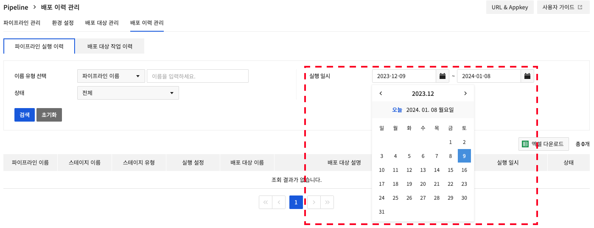
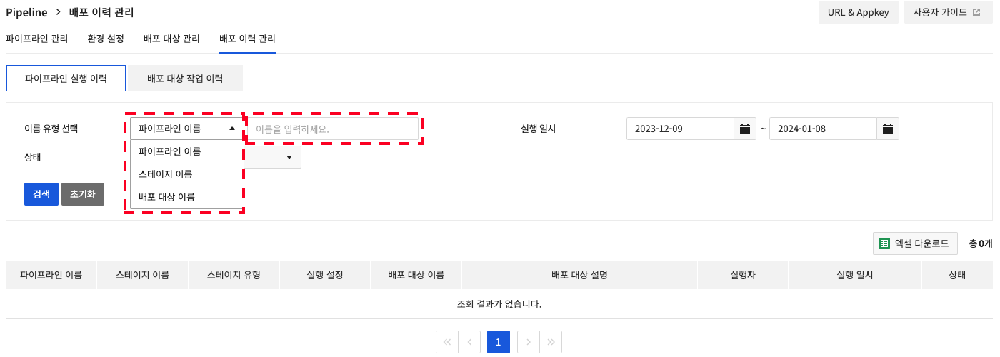
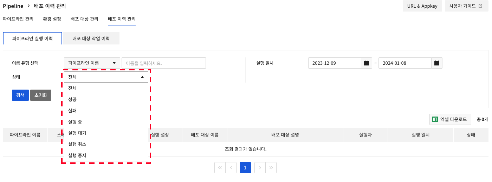
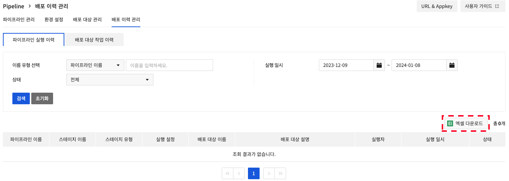
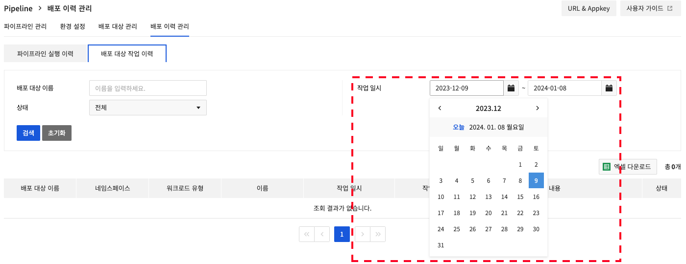
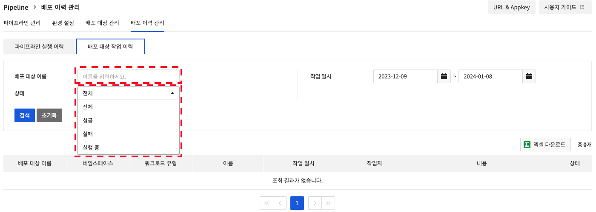
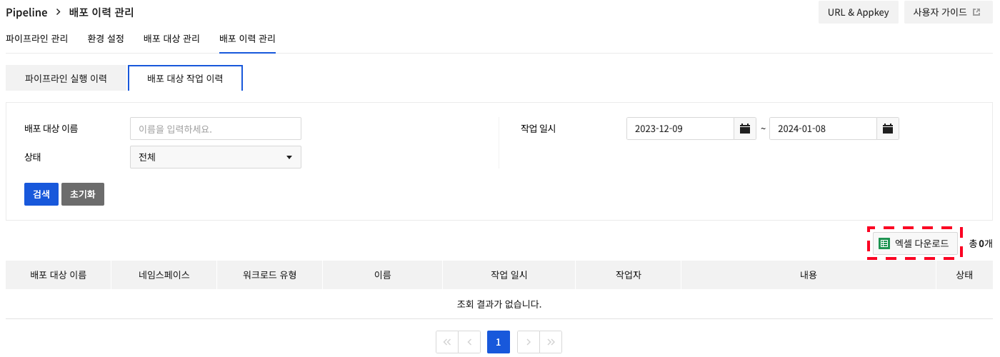

<!-- pre-align:aligned sig=7c15c57a6d7c -->

## Dev Tools > Pipeline > 콘솔 사용 가이드 > 배포 이력 관리 { #dev-tools-pipeline-console-user-guide-deployment-history-management }

Pipeline 실행 이력과 배포 대상 작업 이력을 **배포 이력 관리** 탭에서 확인할 수 있습니다.

## 파이프라인 실행 이력 { #pipeline-run-history }
스테이지 실행 일시를 기준으로 파이프라인의 실행 이력을 확인할 수 있는 페이지입니다.

실행 일시를 설정하여 선택한 기간의 스테이지 실행 이력을 조회할 수 있습니다. 기간은 최대 6개월까지 설정할 수 있습니다.

**이름 유형**과 **스테이지 상태**로 필터링된 결과를 조회합니다.

**엑셀 다운로드**를 클릭해 조회한 결과를 다운로드할 수 있습니다.

## 배포 대상 작업 이력 { #deployment-target-task-history }
워크로드 작업 일시를 기준으로 배포 대상의 작업 이력을 확인할 수 있는 페이지입니다.

작업 일시를 설정하여 선택한 기간의 워크로드 작업 이력을 조회할 수 있습니다. 기간은 최대 6개월까지 설정할 수 있습니다.

**배포 대상 이름**과 **상태**로 필터링된 결과를 조회합니다.

**엑셀 다운로드**를 클릭해 조회한 결과를 다운로드할 수 있습니다.

필드에 대한 자세한 설명은 [배포 대상 관리](./deploy-target-monitoring/) 페이지에서 확인 가능합니다.