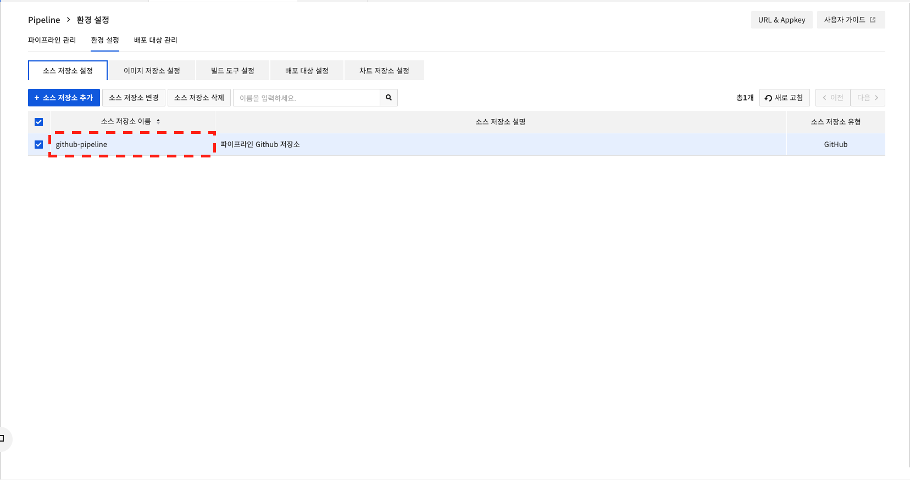
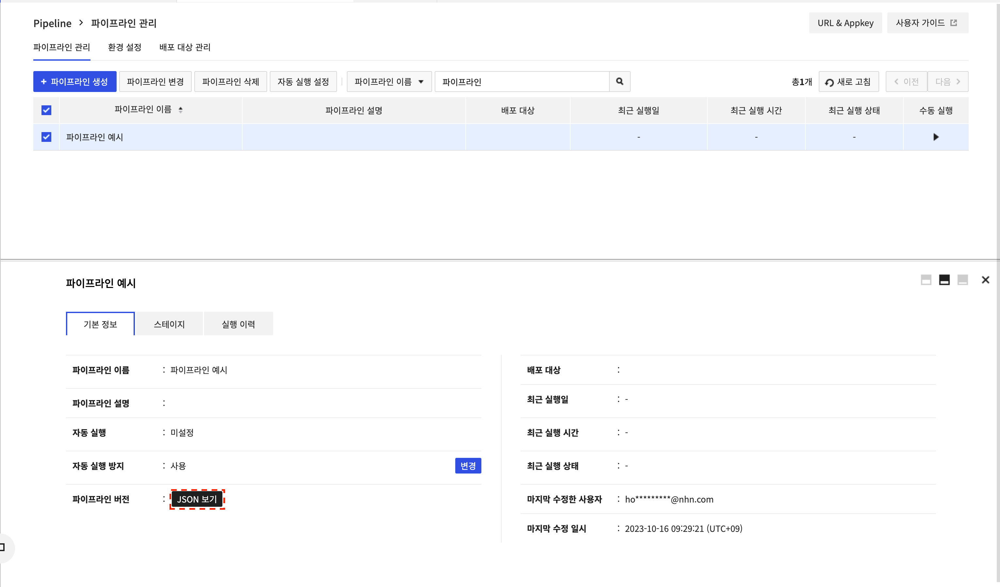
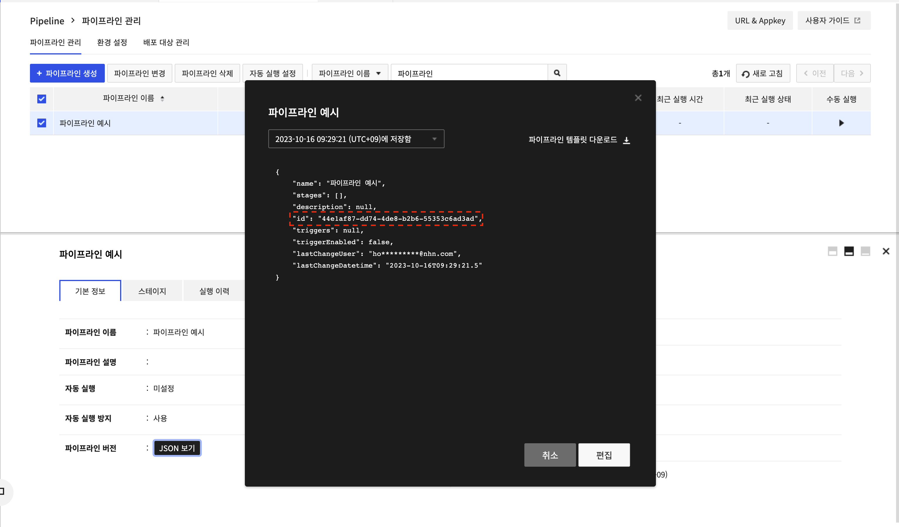

## Dev Tools > Pipeline > 콘솔 사용 가이드 > 템플릿 가이드
템플릿 가이드에서는 템플릿 파일을 이용하여 파이프라인 생성하는 방법을 설명합니다.

### 기존 파이프라인과 동일한 파이프라인 생성
기존에 구성되어 있는 파이프라인에서 JSON 파일을 다운로드한 후 동일한 형태의 신규 파이프라인을 생성하는 방법입니다.

#### 1. 기존 파이프라인 JSON 파일 다운로드
기존 파이프라인을 선택하여 기본 정보의 **JSON 보기** > **파이프라인 템플릿 다운로드**를 통해 JSON 파일을 다운로드할 수 있습니다.

#### 2. 템플릿 파일로 파이프라인 생성
2.1 **파이프라인 관리**에서 **파이프라인 생성**을 클릭합니다. 다운로드한 JSON 파일을 업로드합니다. 업로드 후 **다음**을 클릭하게 되면 바로 **최종 검토** 단계로 넘어가게 됩니다.

2.2 **최종 검토** 단계에서 등록된 파일명 확인이 가능하며 **생성**을 클릭하면 파이프라인이 생성됩니다.

### 샘플 시나리오 템플릿으로 파이프라인 생성
시나리오마다 샘플 템플릿 파일을 제공하여 손쉽게 파이프라인을 생성할 수 있습니다. 원하는 시나리오에 있는 JSON 파일을 다운로드 한 뒤 중괄호로 요구하는 데이터를 입력하여 사용할 수 있습니다.

Bake Stage 사용에 대한 샘플 시나리오 템플릿의 경우 기능 변경이 필요하여 추후 제공 될 예정입니다.

#### 1. 소스 - 빌드 - 배포 단계의 기본적인 시나리오
{파일 링크}

Github에서 소스코드를 가져와 NHN Build 도구를 통해 빌드 후 대상 서버에 Manifest 정보로 배포하는 시나리오입니다. 

등록되어 있는 JSON 파일을 다운로드 후 중괄호로 표시된 데이터에 대한 정보의 입력이 필요합니다.

예를 들어 `"sourceRepo": "{소스 저장소 설정에 저장된 소스 저장소 이름}"` 이라고 입력값을 요구하고 있으며

**환경 설정** 내 소스 저장소 설정에 등록한 정보 중 사용할 소스 저장소 이름을 확인 후 `"sourceRepo": "github-pipeline"` 과 같이 수정이 필요합니다.

**이미지 저장소 설정**, **배포 대상 설정** 도 동일하게 설정된 이름을 확인 후 수정이 필요합니다.

Deploy시 사용되는 Manifest 정보의 경우 배포 환경에 맞도록 변경이 필요합니다.

이후 시나리오도 해당 시나리오를 바탕으로 작성되어 있습니다.

#### 2. 파이프라인 완료 알림 추가된 시나리오
{파일 링크}

배포 후 Webhook을 통해 알림을 받을 수 있습니다. Webhook을 받을 URL과 Payload, Method에 해당하는 데이터를 입력 후 사용 가능합니다.

#### 3. Github(GitLab, 이미지 저장소) 이벤트 발생 시 Pipeline 자동 실행 시나리오
{파일 링크}

Trigger 기능으로 Github(GitLab, 이미지 저장소)에서 발생하는 이벤트로 파이프라인을 실행 가능 합니다.

#### 4. 하나의 파이프라인으로 개발환경, 리얼환경을 구분해서 배포하는 시나리오
{파일 링크}

하나의 파이프라인으로 사용자의 선택으로 분기처리를 하여 배포할 수 있습니다.
해당 시나리오에서는 개발환경, 리얼환경 같이 구분되어 있는 환경에 배포하는 경우로 작성되었습니다.

예시로 작성된 파이프라인처럼 `develop`, `real` 선택하여 각 환경에 배포를 따로 진행 할 수 있습니다.
다른 값으로 변경하여 사용 가능하며 이때 뒤에 있는 Precondition Stage의 값도 동일하게 수정이 필요합니다.

#### 5. 리얼환경에 배포 전 승인 절차를 추가하여 배포하는 시나리오
{파일 링크}

4번 시나리오에서 리얼환경에 배포하기 전 승인 단계를 추가하여 승인 후 배포가 되도록 구성할 수 있습니다.

#### 6. 다수의 파이프라인으로 개발환경, 리얼환경을 구분해서 배포하는 시나리오
{파일 링크}

파이프라인을 환경별로 분리되어 구성되어 있을때 파이프라인 자체를 선택해서 배포 가능합니다.

파이프라인 아이디는 **파이프라인 버전 > JSON 보기**를 클릭하여 확인 가능합니다.

